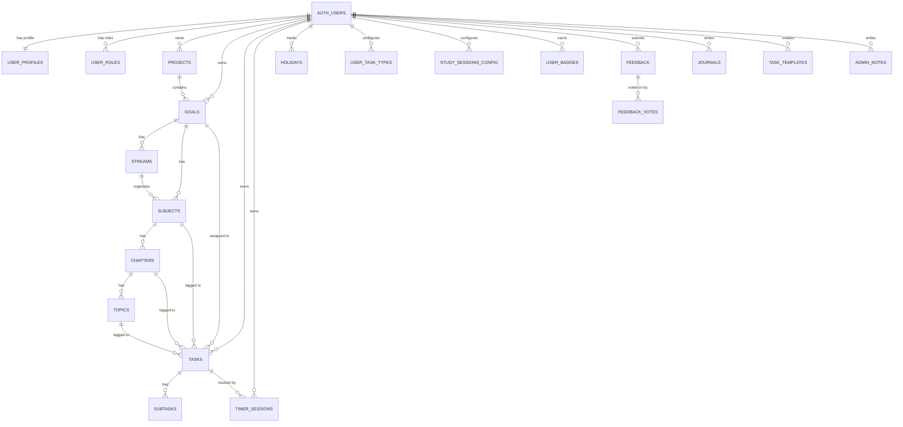

# StudyTracker — Product Specification Document (PSD)

**Version:** 1.0  
**Last Updated:** 2026-02-13  
**Author:** Development Team

---

## 1. Product Overview

**StudyTracker** is a web-based academic progress management platform designed for students preparing for competitive exams, university courses, or self-directed learning. It combines task scheduling, focus timers, hierarchical syllabus management, analytics, and gamification into a unified system. All data is stored in PostgreSQL via Supabase with Row Level Security, ensuring complete data isolation between users.

### 1.1 Target Audience

| Segment | Description |
|---------|-------------|
| Competitive exam students | UPSC, JEE, NEET, GATE, CAT, or similar exam preparation |
| University students | Semester-based course tracking with subjects and assignments |
| Self-learners | Any structured learning with topics and chapters |
| Administrators | Platform operators managing users, feedback, and content |

### 1.2 Core Value Propositions

1. **Structured hierarchy** — Organize study content as Projects → Goals → Streams → Subjects → Chapters → Topics
2. **Smart task management** — Priority system (1–9999), scheduling, postponement, and exam-specific scoring
3. **Focus tracking** — Pomodoro timer linked to tasks with real-time duration logging
4. **Data-driven insights** — Analytics on study patterns, consistency, discipline, and focus
5. **Gamification** — XP, levels, badges, and streaks for motivation
6. **Encrypted backups** — AES-256 encrypted data export/restore

---

## 2. System Architecture

### 2.1 Technology Stack

| Layer | Technology | Purpose |
|-------|-----------|---------|
| Frontend Framework | React 18 + TypeScript | Component-based UI |
| Build System | Vite | Fast dev server and bundling |
| Styling | Tailwind CSS + shadcn/ui | Utility-first CSS + accessible components |
| Backend | Supabase (PostgreSQL 15) | Database, Auth, Storage, Realtime |
| State Management | TanStack React Query | Server state cache + invalidation |
| Local State | Zustand | Timer store, ephemeral UI state |
| Routing | React Router DOM v6 | Client-side navigation |
| Form Handling | React Hook Form + Zod | Validation and typed form state |
| Charts | Recharts | SVG-based data visualization |
| Icons | Lucide React | Tree-shakable icon set |

### 2.2 Authentication

- Email/password auth via Supabase Auth
- OAuth support via Supabase (configurable)
- Session tokens managed by `@supabase/supabase-js`
- Auto-redirects: guests → landing page, authenticated users → dashboard

### 2.3 Security Model

| Layer | Mechanism |
|-------|-----------|
| Data isolation | Row Level Security (RLS) on every table |
| Auth | Supabase JWT tokens (anon key is public-safe) |
| Admin access | `user_roles` table + `has_role()` SQL function |
| Admin queries | `SECURITY DEFINER` functions with role checks |
| Backups | Client-side AES-256-GCM encryption (PBKDF2 key derivation) |
| Rate limiting | 5-minute localStorage cooldown on contact form |

---

## 3. Data Model

### 3.1 Entity Relationship Diagram



### 3.2 Core Tables

| Table | Primary Key | Purpose | RLS |
|-------|-----------|---------|-----|
| `user_profiles` | `user_id` (FK → auth.users) | XP, streaks, settings, avatar | Owner only |
| `projects` | `project_id` | Optional top-level containers | Owner only |
| `goals` | `goal_id` | Primary organizational unit (exam, semester, custom) | Owner only |
| `streams` | `stream_id` | Sub-divisions of goals (e.g., Physics, Chemistry) | Via parent goal |
| `subjects` | `subject_id` | Individual subjects with weightage | Via parent goal |
| `chapters` | `chapter_id` | Chapters within subjects | Via parent chain |
| `topics` | `topic_id` | Individual topics with difficulty tags | Via parent chain |
| `tasks` | `task_id` | Study/exam tasks with scoring | Owner only |
| `subtasks` | `subtask_id` | Checklist items within tasks | Via parent task |
| `timer_sessions` | `session_id` | Pomodoro focus/break sessions | Owner only |
| `holidays` | `holiday_id` | Days off (can be partial %) | Owner only |
| `user_task_types` | `task_type_id` | Custom task categories | Owner only |
| `study_sessions_config` | `session_config_id` | Study time windows | Owner only |
| `badges` | `badge_id` (VARCHAR) | Badge definitions (global, read-only) | Read: all |
| `user_badges` | `(user_id, badge_id)` | Earned badges per user | Owner only |
| `journals` | `journal_id` | Daily study journal entries | Owner only |
| `task_templates` | `template_id` | Recurring task templates | Owner only |
| `feedback` | `feedback_id` | Bug reports / feature requests | Read: all, Write: owner |
| `feedback_votes` | `vote_id` | User votes on feedback items | Owner for write |
| `user_roles` | `id` | Admin/moderator role assignments | Owner read, admin write |
| `contact_submissions` | `id` | Public contact form messages | Insert: public, View: admin |
| `admin_notes` | `id` | Private admin notes | Owner only |
| `backups_metadata` | `backup_id` | Backup file metadata | Owner only |

### 3.3 Computed / Generated Columns

| Table | Column | Formula |
|-------|--------|---------|
| `user_profiles` | `current_level` | `FLOOR(SQRT(total_xp / 100)) + 1` |
| `tasks` | `skipped_questions` | `total_questions - attempted_questions` |
| `tasks` | `total_marks` | `total_questions × marks_per_question` |
| `timer_sessions` | `duration_seconds` | `end_time - start_time` (epoch diff) |
| `study_sessions_config` | `is_overnight` | `end_time < start_time` |
| `holidays` | `is_partial` | `study_percentage > 0` |

### 3.4 Auto-Triggers

| Trigger | Table | Action |
|---------|-------|--------|
| `on_auth_user_created` | `auth.users` | Creates profile, seeds study sessions + task types |
| `update_*_timestamp` | All tables | Sets `updated_at = NOW()` before UPDATE |
| `update_task_duration_trigger` | `timer_sessions` | Recalculates `tasks.actual_duration` from all sessions |
| `trigger_update_topic_completion` | `tasks` | Cascading: marks topics complete when all tasks done |
| `trigger_update_chapter_completion` | `topics` | Marks chapters complete when all topics complete |
| `trigger_update_subject_completion` | `chapters` | Marks subjects complete when all chapters complete |
| `trigger_update_stream_or_goal_from_subject` | `subjects` | Cascading: marks streams/goals complete |
| `trigger_update_goal_from_stream` | `streams` | Marks goals complete when all streams complete |
| `trigger_update_project_completion` | `goals` | Marks projects complete when all goals complete |
| `validate_*_weightage` | streams/subjects/chapters/topics | Ensures weightage doesn't exceed 100% |

---

## 4. Feature Specification

### 4.1 Authentication & Authorization

#### 4.1.1 User Registration
- Fields: email, password, optional username
- Auto-generates profile, 3 default study sessions, 6 default task types
- Username format: `user_{first_8_chars_of_uuid}` (if not provided)

#### 4.1.2 Login / Logout
- Email + password authentication
- Remember session across tabs (Supabase handles token refresh)
- Logout clears session

#### 4.1.3 Password Recovery
- Forgot password → email link → reset password page
- Password requirements: 8+ chars, uppercase, lowercase, number

#### 4.1.4 Role System

| Role | Access |
|------|--------|
| `user` | Default — no entry in `user_roles` |
| `moderator` | Can view contact submissions and feedback |
| `admin` | Full admin panel: users, health, badges, feedback, notes |

### 4.2 Hierarchy System

The hierarchy provides 6 levels of organization. Only **Goals** and **Tasks** are mandatory; all others are optional.

```
Project (optional)
  └── Goal (required, has type: board/competitive/semester/custom)
        ├── Stream (optional, has weightage)
        │     └── Subject (has weightage)
        │           └── Chapter
        │                 └── Topic (has difficulty: easy/medium/hard)
        └── Subject (direct, no stream)
              └── Chapter
                    └── Topic
```

**Completion cascading:** When all tasks under a topic are done → topic marked complete → chapter → subject → stream → goal → project. All automatic via database triggers.

**Weightage system:** Streams, subjects, chapters, and topics support 0–100% weightage. Triggers enforce that the total per parent doesn't exceed 100%.

### 4.3 Task Management

#### 4.3.1 Task Properties

| Field | Type | Description |
|-------|------|-------------|
| `name` | VARCHAR(200) | Task title (required) |
| `task_type` | VARCHAR(50) | study, practice, exam, etc. |
| `status` | ENUM | scheduled → pending → in_progress → done / postponed |
| `priority_number` | INTEGER | 1 (highest) to 9999 (lowest) |
| `scheduled_date` | DATE | When the task is planned |
| `estimated_duration` | INTEGER | Expected minutes |
| `actual_duration` | INTEGER | Auto-calculated from timer sessions |
| `difficulty_level` | VARCHAR | User-set after completion |
| `grade` | VARCHAR | User-set grade (A, B, C…) |

#### 4.3.2 Exam-Specific Fields

For task_type = exam/mocktest/test:

| Field | Description |
|-------|-------------|
| `total_questions` | Number of questions in exam |
| `attempted_questions` | How many the user attempted |
| `correct_answers` / `wrong_answers` | Scoring breakdown |
| `marks_per_question` | Points per question |
| `negative_marking` | Deduction per wrong answer |
| `time_taken_minutes` | Duration of exam |
| `accuracy_percentage` | Calculated accuracy |
| `speed_qpm` | Questions per minute |

#### 4.3.3 Postponement

- Tasks can be postponed to a future date
- Original `scheduled_date` preserved in `postponed_from_date`
- Status changes to `postponed` then resets to `scheduled` on new date

#### 4.3.4 Subtasks

- Ordered checklist items within a task
- Toggle complete/incomplete
- `order_index` for drag-and-drop ordering

### 4.4 Pomodoro Timer

#### 4.4.1 Configuration (per user)

| Setting | Default | Range |
|---------|---------|-------|
| Focus duration | 25 min | 5–120 min |
| Short break | 5 min | 1–30 min |
| Long break | 15 min | 5–60 min |
| Cycles before long break | 4 | 1–10 |
| Auto-start break | OFF | Toggle |
| Auto-start focus | OFF | Toggle |

#### 4.4.2 Behavior

- Timer is linked to a specific task
- Each focus/break period creates a `timer_sessions` record
- `actual_duration` on the task is auto-recalculated via trigger
- Supports pause with `paused_duration_seconds` tracking

### 4.5 Study Sessions

Configurable time windows that define when the user studies:

| Field | Description |
|-------|-------------|
| Name | e.g., "Morning Focus" |
| Start time / End time | Time range |
| Days of week | Mon–Sun multi-select |
| Color | Color tag |
| Overnight support | Auto-detected when end < start |

Default sessions created on signup: Morning Focus (8–11), Afternoon Deep Work (14–17), Evening Review (19–21).

### 4.6 Calendar

Views: **Day**, **Week**, **Month**, **Agenda**

- Tasks displayed on their `scheduled_date`
- Day view renders only relevant hours (from `start_of_day_hour` to last event + 2 hours)
- Auto-scrolls to current hour on mount
- Holidays shown with markers

### 4.7 Analytics Dashboard

Analytics cards include:
- **Weekly study time** — Total hours per day of the week
- **Monthly trends** — Dual-line chart (study time + tasks)
- **Task completion rate** — Percentage of done vs total
- **Focus analytics** — Average session length, total Pomodoro cycles
- **Discipline score** — Based on consistency and completed vs scheduled
- **Subject/Goal progress** — Weighted progress per subject/goal

### 4.8 Gamification

#### 4.8.1 XP & Levels

- XP earned on task completion (amount based on `base_xp` of task type)
- Level formula: `FLOOR(SQRT(total_xp / 100)) + 1`
- `lifetime_xp` tracks all-time, `total_xp` can be adjusted

#### 4.8.2 Streaks

- Daily streak incremented when study criteria met
- Criteria configurable: minimum minutes, minimum tasks, mode (ANY/ALL)
- Holidays preserve streaks (not counted as breaks)
- Partial holidays allow reduced study percentage

#### 4.8.3 Badges

Categories: streak, time, task, exam, subject, milestone  
Tiers: bronze → silver → gold → platinum  
15 default badges seeded (e.g., Week Warrior, Perfect Score, Task Master)  
Supports multi-level badges via `levels` JSONB field

### 4.9 Data Management

#### 4.9.1 Backup
- Exports all user data across 14 tables
- Encrypted with AES-256-GCM (PBKDF2 key derivation, 100K iterations)
- Downloads as JSON with metadata (table counts, timestamps)

#### 4.9.2 Restore
- Upload previously exported backup file
- Enter the same passphrase used during backup
- Merge mode: existing records updated, new records added

### 4.10 Syllabus Import

- Paste or upload a JSON file defining goals, streams, subjects, chapters, topics
- Validates structure before import
- Sets optional start/end dates per goal
- Creates entire hierarchy in a single operation

### 4.11 Task Templates

- Create reusable task templates with pre-filled fields
- Supports recurrence: daily (templates define pattern)
- Templates linked to specific goals, subjects, chapters, topics
- Can reference specific study session time slots

### 4.12 Journal

- One entry per day (unique constraint on user_id + date)
- Free-text content
- Browseable by date

### 4.13 Feedback System

- Users submit bugs or feature requests
- Fields: title, description, type (bug/feature/feedback), page, screenshot URL
- Community voting system (upvote/downvote)
- Admin fields: priority, category, status, admin_notes
- Status flow: submitted → in_review → planned → in_progress → completed/resolved/rejected/duplicate

### 4.14 Contact Form

- Public (no login required)
- Fields: name, email, subject, message
- 5-minute cooldown between submissions (localStorage-based)
- Admins/moderators can view, archive, and manage submissions

---

## 5. Admin Panel

### 5.1 Admin Dashboard
- Overview metrics: total users, tasks, active streaks
- Quick links to management pages

### 5.2 User Management
- Lists all registered users via `get_admin_user_list()` RPC
- Shows: email, signup date, last sign-in, metadata
- Secured via SECURITY DEFINER function with admin role check

### 5.3 System Health
- Database connectivity status
- Query latency measurement
- User count, task count
- App version display

### 5.4 Feedback Management
- View all user feedback with status, priority
- Update status and add admin notes

### 5.5 Contact Messages
- View public contact form submissions
- Mark as read/archived

### 5.6 Admin Notes
- Private, per-admin note-taking
- CRUD operations with pin/unpin
- RLS ensures admins only see their own notes

### 5.7 Badge Management
- View badge definitions
- Badge documentation page

### 5.8 Dev Docs
- In-app technical documentation
- Organized by section: Getting Started, Features, Constraints

---

## 6. Pages & Routes

### 6.1 Public Routes (No Auth Required)

| Route | Page | Description |
|-------|------|-------------|
| `/` | Landing | Hero + features + CTA (redirects to dashboard if logged in) |
| `/features` | Features | Interactive feature showcase |
| `/contact` | Contact | Public contact form with rate limiting |
| `/privacy` | Privacy Policy | Static policy page |
| `/login` | Login | Email/password login |
| `/signup` | Signup | Email/password registration |
| `/forgot-password` | Forgot Password | Password reset request |
| `/reset-password` | Reset Password | New password form |

### 6.2 Protected Routes (Login Required)

| Route | Page | Description |
|-------|------|-------------|
| `/dashboard` | Dashboard | Today's tasks, calendar widget, stats, templates, trends |
| `/calendar` | Calendar | Day/Week/Month/Agenda views |
| `/analytics` | Analytics | Study metrics, charts, progress |
| `/projects` | Projects | Project listing and creation |
| `/projects/:id` | Project Detail | Goals within a project |
| `/goals` | Goals | Goal listing and creation |
| `/goals/:id` | Goal Detail | Subjects, streams, tasks within a goal |
| `/settings` | Settings | All user preferences and configuration |
| `/timer` | Timer | Pomodoro timer interface |
| `/badges` | Badges | View earned and available badges |
| `/holidays` | Holidays | Mark/manage holidays |
| `/tasks` | Tasks | Task listing with filters |
| `/tasks/:id` | Task Detail | Full task view with subtasks |
| `/journal` | Journal | Daily journal entries |
| `/hierarchy` | Hierarchy | Visual tree of all study content |
| `/feedback` | Feedback | Submit and browse feedback |
| `/help` | Help | Searchable FAQs and documentation |
| `/menu` | Menu | Mobile-friendly grid navigation |

### 6.3 Admin Routes (Admin Role Required)

| Route | Page |
|-------|------|
| `/admin` | Admin Dashboard |
| `/admin/users` | User Management |
| `/admin/health` | System Health |
| `/admin/badges` | Badge Management |
| `/admin/badges/docs` | Badge Documentation |
| `/admin/syllabus/docs` | Syllabus Import Docs |
| `/admin/feedback` | Feedback Management |
| `/admin/contact-us` | Contact Messages |
| `/admin/notes` | Admin Notes |
| `/admin/docs-dev` | Dev Documentation |

---

## 7. Settings Specification

### 7.1 Profile Settings
- Edit username (20 char max, validated)
- Upload/change profile picture (Supabase Storage)
- Change password (current + new + confirm)
- Delete account (with confirmation dialog)

### 7.2 Appearance
- Theme toggle: Light / Dark / System

### 7.3 Pomodoro Timer
- Focus duration (5–120min slider)
- Short break (1–30min slider)
- Long break (5–60min slider)
- Cycles before long break (1–10)
- Auto-start break toggle
- Auto-start focus toggle

### 7.4 Streak Conditions
- Mode: ANY condition (OR) / ALL conditions (AND)
- Minimum study time (minutes)
- Minimum tasks completed
- Require all scheduled tasks toggle

### 7.5 Study Sessions
- CRUD for study time windows
- Day start hour configuration (0–23)
- Overlap validation

### 7.6 Task Types
- CRUD for custom task types
- Name, icon (emoji), default duration, base XP
- System behavior: study / practice / exam / assignment / revision

### 7.7 Syllabus Import
- JSON paste or file upload
- Validation preview with error display
- Optional date range per goal
- Batch import execution

### 7.8 Task Templates
- CRUD for reusable task templates
- Pre-fill: goal, subject, chapter, topic, type, priority, duration, time slot
- Recurrence pattern

### 7.9 Data Management
- Encrypted backup download
- Restore from backup file

---

## 8. Non-Functional Requirements

| Category | Requirement |
|----------|-------------|
| Performance | Page load < 2s, DB queries < 500ms |
| Security | RLS on all tables, encrypted backups, SECURITY DEFINER for cross-user queries |
| Availability | Relies on Supabase infrastructure (99.9% SLA) |
| Scalability | Per-user data isolation enables horizontal scaling |
| Browser Support | Chrome (latest), Firefox (latest), Safari (latest), Edge (latest) |
| Mobile | Responsive design with mobile bottom nav and menu page |
| Accessibility | shadcn/ui components follow WAI-ARIA patterns |
| Data Integrity | Foreign key constraints, CHECK constraints, trigger validations, weightage limits |

---

## 9. Database Migrations

### 9.1 Original Files (41 files in `sql/`)

Sequential migration files numbered 001–070 plus `seed_demo_data.sql`.

### 9.2 Merged Files (10 files in `merged-sql/`)

For fresh installations, all migrations are consolidated into 10 files that must be run in order (01→10).

---

## 10. Glossary

| Term | Definition |
|------|-----------|
| Goal | The primary study target (e.g., JEE 2027, Semester 3) |
| Stream | A subdivision of a goal (e.g., PCM streams) |
| Subject | A single subject within a stream or goal |
| Chapter | A chapter within a subject |
| Topic | An individual topic within a chapter |
| Weightage | Percentage importance assigned to hierarchy items (0–100%) |
| XP | Experience points earned for completing tasks |
| Streak | Consecutive days meeting study criteria |
| Task Type | Category of study activity (study, exam, practice, etc.) |
| Study Session | A configured time window for studying |
| Pomodoro | Timed focus/break cycle technique |
| RLS | Row Level Security — PostgreSQL feature restricting data access per user |
| SECURITY DEFINER | SQL function that runs with the privileges of the function creator |
